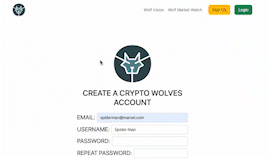

# CryptoWolves

CryptoWolves is a Flask-based Python web application built to explore backend web development, external API integration, and dynamic data presentation.

The project focuses on ingesting third-party market data, processing it server-side, and rendering it through a structured web interface using Flask templates.

---

## Project Goals

- Practice building backend web applications with Python and Flask
- Integrate and consume data from third-party APIs
- Display dynamic, data-driven content in a maintainable web application
- Explore application structure, routing, and server-rendered views

---

## Core Features

- Flask-based backend with structured routing
- Integration with external market data APIs
- Dynamic server-rendered pages using Flask templates
- Organized project structure for scalability and maintainability
- Basic social-style navigation and page flows

---

## Tech Stack

- **Backend:** Python, Flask
- **Templating:** Jinja2
- **APIs:** External cryptocurrency market data APIs
- **Frontend:** HTML, CSS (server-rendered)
- **Environment:** Local development server

---

## Architecture Overview

CryptoWolves follows a traditional Flask MVC-style architecture with server-rendered views and a relational database backend.

Client (Browser)
   ↓ HTTP requests
Flask Application
   ├─ Controllers (route handlers)
   ├─ Models (database access & business logic)
   ├─ Templates (Jinja2 HTML rendering)
   └─ Session-based authentication
        ↓
MySQL Database

---

## What I Learned

- Working with third-party APIs and handling external data sources
- Structuring Flask applications for clarity and maintainability
- Designing routes and templates for dynamic content rendering
- Managing data flow between backend logic and presentation layers

---

## Future Improvements

- Improve error handling and validation around external API responses
- Add caching to reduce redundant API calls
- Refactor application structure for larger-scale features
- Enhance UI styling and layout consistency

---

## Disclaimer

This project was built as a learning exercise focused on backend development and API integration. It is not intended for production use or financial decision-making.

Used 1 image from <a href="https://unsplash.com/">unsplash</a>

<h2 align:"center">Landing Page</h2>

<h2 align:"center">User Sign Up</h2>

<h2 align:"center">Market Watch</h2>

<h2 align:"center">Edit Profile Page</h2>

<h2 align:"center">All Members Page</h2>

