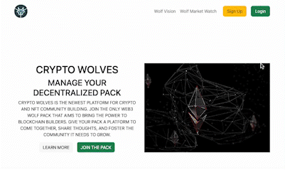
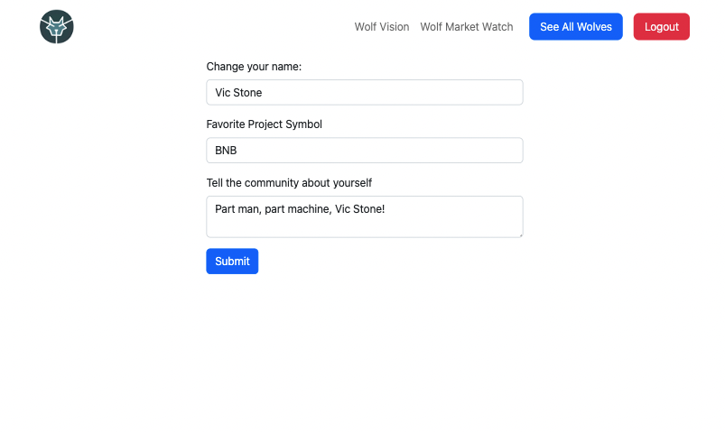

<h1 align:"center">Crypto Wolves</h1>

A Flask cryptocurrency social media project where users can sign up, make posts, and see other profiles.

All technologies/tools used:

<ul>
    <li>Python3</li>
    <li>Flask</li>
    <li>Jinja2</li>
    <li>B-crypt</li>
    <li>Regex</li>
    <li>MySQL</li>
    <li>MySQLWorkbench</li>
    <li>Javascript</li>
    <li>Chartjs</li>
    <li>CoinGecko Market APIs</li>
    <li>HTML5</li>
    <li>CSS3</li>
    <li>Balsamiq</li>
    <li>Trello</li>
</ul>

Used 1 image from <a href="https://unsplash.com/">unsplash</a>

<h2 align:"center">Landing Page</h2>

<h2 align:"center">User Sign Up</h2>

<h2 align:"center">Market Watch</h2>

<h2 align:"center">Edit Profile Page</h2>

<h2 align:"center">All Members Page</h2>

